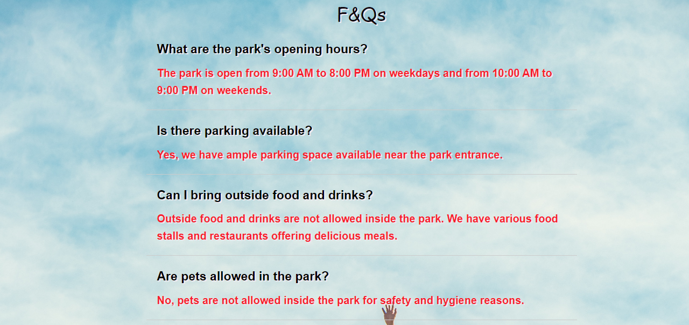

# Amusement Park 🏞️

Welcome to the official repository for the Amusement Park website! This README will provide you with an overview of the website's content, its structure, how to navigate through the various sections, and details on getting started. Whether you're a developer, a user, or just curious about what the park has to offer, this document will guide you through the different aspects of our website.

## Table of Contents

- [Amusement Park](#amusement-park)
  - [Table of Contents](#table-of-contents)
  - [Summary](#summary)
  - [Website Sections](#website-sections)
    - [Tickets](#tickets)
    - [Accommodation](#accommodation)
    - [Gallery](#gallery)
    - [Attractions](#attractions)
    - [Events](#events)
    - [Food](#food)
    - [Frequently Asked Questions (FAQ)](#frequently-asked-questions-faq)
    - [About](#about)
    - [Feedback](#feedback)
    - [Contact](#contact)

---

## Summary

Our Amusement Park website offers an exciting and immersive experience for visitors of all ages. With a wide range of attractions, events, and delicious food options, you're sure to have an unforgettable time at our park. From thrilling rides to relaxing accommodations, there's something for everyone here. This README will help you explore the various sections of our website and make the most out of your visit.

---

## Website Sections

### Tickets

Purchase your tickets online and skip the long lines! Choose from single-day passes, family packages, and more. Our ticketing system is convenient and user-friendly.

### Accommodation

Make your visit more comfortable by staying at our on-site accommodations. We offer cozy lodges and luxurious cabins, providing a relaxing retreat after a day of excitement.

### Gallery

Explore our gallery to get a glimpse of the park's beauty and attractions. High-quality images showcase the rides, shows, and landscapes that await you.

### Attractions

Discover a wide variety of attractions, from heart-pounding roller coasters to family-friendly rides. Check out attraction descriptions, height requirements, and thrill levels to plan your adventure.

### Events

Stay updated on upcoming events, shows, and performances at the park. Whether it's a live concert, a magic show, or a seasonal celebration, there's always something happening.

### Food

Satisfy your cravings with our diverse food options. From classic amusement park treats like cotton candy and popcorn to gourmet dining, we have something to please every palate.

### Frequently Asked Questions (FAQ)

Find answers to common questions in our FAQ section. From park hours to accessibility information, we've got you covered.

### About

Learn about the history of our park, our mission, and our commitment to providing safe and enjoyable experiences for all visitors. Get to know our team and the values that drive us.

### Feedback

We value your feedback! Share your experience and suggestions with us. Your input helps us continuously improve and create the best possible guest experience.

### Contact

If you have any inquiries or need assistance, feel free to contact our customer support team. We're here to help!
